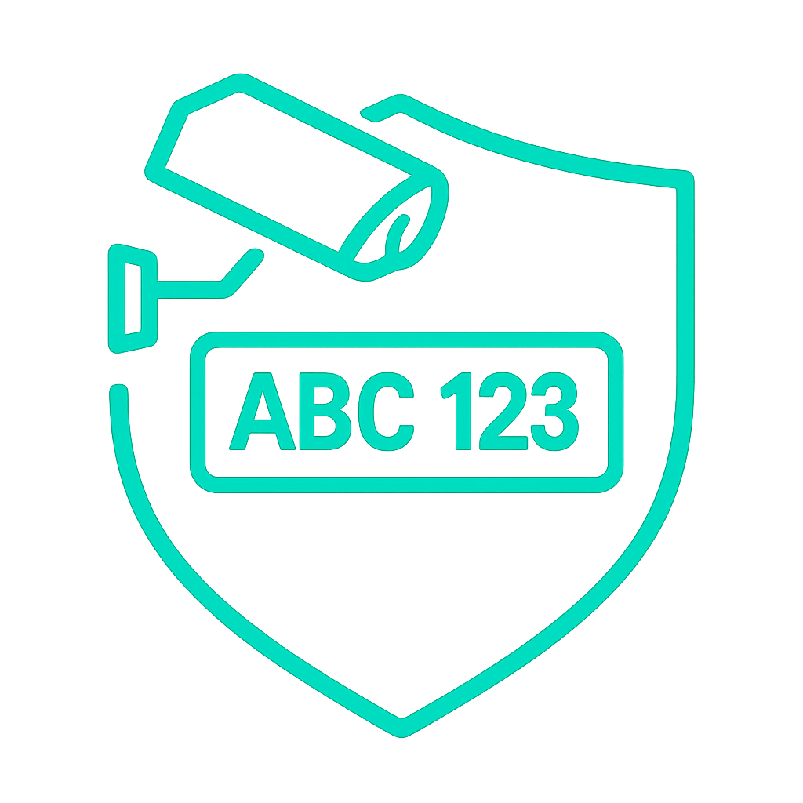

<p align="center">
  
</p>

<h1 align="center">GatePlate</h1>

<p align="center">
  <strong>AI-Powered License Plate Recognition & Gate Access Control System</strong>
</p>

<p align="center">
  
  
  
  
  
</p>

---

## 📋 Overview

**GatePlate** is a full-stack application that automates vehicle gate access control using AI-powered license plate recognition. The system processes both live video streams and uploaded photos to detect, read, and verify license plates against a database of registered vehicles, employees, and access permits.

### Key Capabilities

- 🎥 **Real-time Video Monitoring** — Analyze live CCTV/IP camera feeds with automatic plate detection
- 📸 **Photo Recognition** — Upload a photo to instantly identify a vehicle's plate number
- 🤖 **AI Vision Engine** — YOLOv8 object detection + Tesseract OCR with perspective correction
- 🔐 **Role-Based Access Control** — Administrators, Operators, and Guest user roles
- 🚗 **Vehicle & Employee Management** — Full CRUD for employees, vehicles, departments, and access permits
- ⛔ **Blacklist System** — Block/unblock vehicles in real time
- 🔑 **API Key Subscriptions** — Monetized API access with 1-month, 3-month, and 1-year plans
- 📂 **Detection Archive** — Searchable history of all recognized plates with timestamped images

---

## 🏗️ Architecture

```
GatePlate/
├── gateplate-backend/          # Django REST API
│   ├── core/                   # Django project settings & URLs
│   ├── recognition/            # Main app (models, views, serializers)
│   ├── scripts/                # VisionEngine (YOLO + Tesseract pipeline)
│   ├── ai_models/              # YOLOv8 trained model (best.pt)
│   ├── videos/                 # Video files & media storage
│   ├── requirements.txt
│   └── manage.py
│
├── gateplate-frontend/         # React SPA
│   ├── src/
│   │   ├── pages/              # Home, Archive, Employees, Vehicles,
│   │   │                       # Login, PhotoRecognition, RegisterCar
│   │   ├── components/         # Footer, PlateRow
│   │   ├── services/           # API service layer
│   │   ├── DataContext.js      # Global state (React Context)
│   │   └── App.js              # Router & role-based navigation
│   └── package.json
│
├── .github/workflows/          # CI/CD workflows
├── .gitignore
└── README.md
```

---

## 🧠 AI Pipeline

The recognition engine (`VisionEngine`) operates in two modes:

### 1. Video Stream Analysis
```
Video Frame → YOLOv8 Plate Detection → Perspective Correction → 
Tesseract OCR → Ukrainian Plate Validation (XX0000XX) → 
Access Check → Auto-save or Manual Confirmation
```

### 2. Single Photo Analysis
```
Uploaded Image → YOLOv8 Detection → Perspective Warp → 
OCR (Normal + Flipped) → Best Result Selection → 
Vehicle DB Lookup → Response
```

**Technical Details:**
- **Model**: YOLOv8 custom-trained on Ukrainian license plates (`best.pt`, ~6MB)
- **OCR**: Tesseract with `--psm 7` (single line), character whitelist `A-Z0-9`
- **Post-processing**: Cyrillic → Latin transliteration, Ukrainian plate pattern matching (`[A-Z]{2}\d{4}[A-Z]{2}`)
- **Confidence threshold**: ≥ 80% for automatic processing, below — manual confirmation required

---

## 🗃️ Data Models

| Model | Description |
|-------|-------------|
| `UserProfile` | Extends Django User — tracks free recognition usage |
| `Camera` | Registered video source (name, URL, active status) |
| `Department` | Hierarchical organizational structure |
| `Employee` | Staff member with photo, department, phone |
| `Vehicle` | License plate, brand/model, linked to employee or guest |
| `AccessPermit` | Time-limited gate access permission per vehicle |
| `BlackList` | Blocked plate numbers |
| `DetectedPlate` | Recognition log (plate, confidence, timestamp, image) |
| `APIKey` | Subscription-based API key with expiry and usage limits |

---

## 🔌 API Endpoints

| Method | Endpoint | Description | Auth |
|--------|----------|-------------|------|
| `POST` | `/api/auth/login/` | Authenticate & receive token + role | Public |
| `POST` | `/api/auth/register/` | Register new guest account | Public |
| `GET` | `/api/start-analysis/` | Start VisionEngine on a video stream | Staff |
| `GET` | `/api/live-update/` | Poll real-time analysis results | Authenticated |
| `POST` | `/api/confirm-plate/` | Manually confirm a detected plate | Staff |
| `POST` | `/api/recognize-photo/` | Upload photo for plate recognition | Authenticated |
| `GET` | `/api/detected-plates/` | Retrieve recent detection history | Staff |
| `GET/POST` | `/api/employees/` | List / Create employees | Staff |
| `GET/PUT/DELETE` | `/api/employees/:id/` | Retrieve / Update / Delete employee | Staff |
| `GET` | `/api/departments/` | List all departments | Staff |
| `GET/POST/PUT/DELETE` | `/api/vehicles/` | Full CRUD for vehicles | Staff |
| `GET` | `/api/vehicles/check_plate/` | Check plate access status | Authenticated |
| `POST` | `/api/guest/register/` | Register guest vehicle | Authenticated |
| `POST` | `/api/update-status/` | Add/remove from blacklist | Staff |
| `POST` | `/api/issue-api-key/` | Issue subscription API key | Authenticated |

---

## 👥 User Roles

| Role | Permissions |
|------|------------|
| **Administrator** | Full access — employees, vehicles, archive, monitoring, photo recognition |
| **Operator** | Monitoring, vehicles, archive, photo recognition (no employee management) |
| **Guest** | Register own vehicle, photo analysis (1 free attempt, then subscription required) |

---

## 🚀 Getting Started

### Prerequisites

- **Python** 3.10+
- **Node.js** 18+
- **MySQL** 8.0+
- **Tesseract OCR** — [Download](https://github.com/tesseract-ocr/tesseract)

### Backend Setup

```bash
cd gateplate-backend

# Create and activate virtual environment
python -m venv .venv
.venv\Scripts\activate        # Windows
# source .venv/bin/activate   # macOS/Linux

# Install dependencies
pip install -r requirements.txt

# Configure database
# Edit core/settings.py — update DATABASES with your MySQL credentials

# Configure Tesseract path
# Edit core/settings.py — update pytesseract.pytesseract.tesseract_cmd

# Run migrations
python manage.py migrate

# Create superuser
python manage.py createsuperuser

# Start development server
python manage.py runserver
```

### Frontend Setup

```bash
cd gateplate-frontend

# Install dependencies
npm install

# Start development server
npm start
```

The frontend will be available at `http://localhost:3000` and expects the backend API at `http://127.0.0.1:8000`.

### AI Model

Place the trained YOLOv8 model file (`best.pt`) in the `gateplate-backend/ai_models/` directory. The system uses this model for license plate detection.

---

## ⚙️ Configuration

### Environment Variables / Settings

Key settings in `gateplate-backend/core/settings.py`:

| Setting | Description |
|---------|-------------|
| `DATABASES` | MySQL connection (name, user, password, host, port) |
| `pytesseract.tesseract_cmd` | Absolute path to the Tesseract executable |
| `CORS_ALLOWED_ORIGINS` | Frontend URL(s) for CORS |
| `REST_FRAMEWORK` | Token + Session authentication, `IsAuthenticated` default |

---

## 🧪 Testing

### Backend Tests

```bash
cd gateplate-backend
pytest
```

Code quality tools configured:
- **Black** — code formatting (line-length 88)
- **isort** — import sorting (Black-compatible profile)
- **Flake8** — linting
- **pytest** — testing with Django settings module

---

## 🛠️ Tech Stack

| Layer | Technology |
|-------|-----------|
| **Frontend** | React 19, React Router 7, Axios, Lucide Icons |
| **Backend** | Django 6.0, Django REST Framework, Token Auth |
| **Database** | MySQL 8.0 |
| **AI/ML** | YOLOv8 (Ultralytics), Tesseract OCR, OpenCV, NumPy |
| **Dev Tools** | Black, isort, Flake8, pytest, GitHub Actions |

---

## 📄 License

This project is private. All rights reserved.

---

<p align="center">
  Built with ❤️ using Django, React & YOLOv8
</p>
